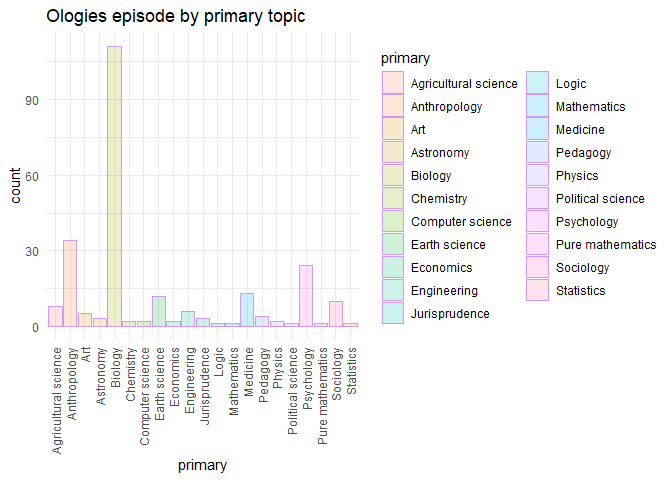
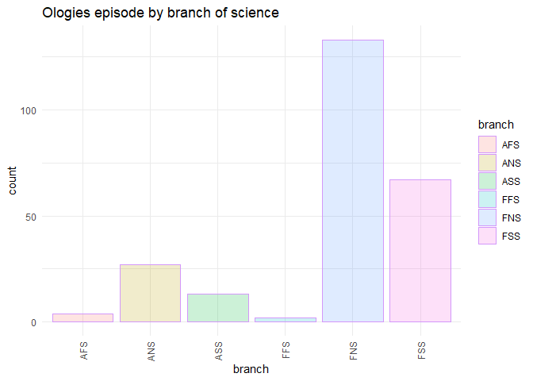
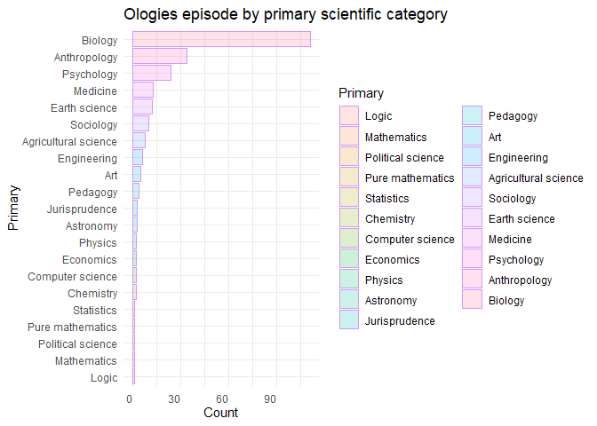
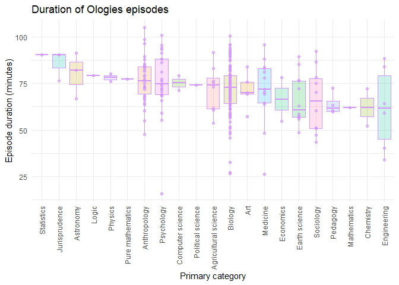
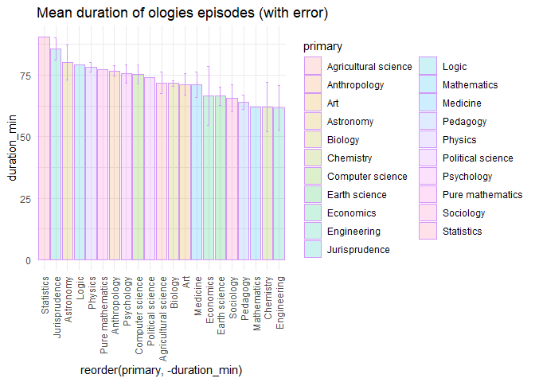
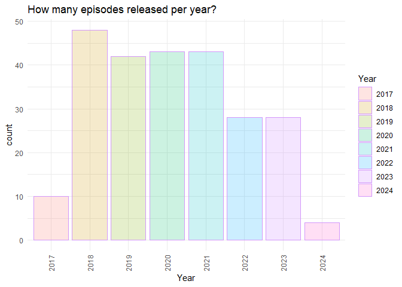
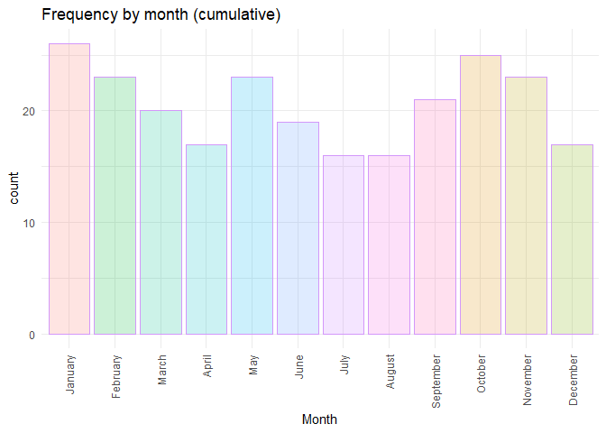
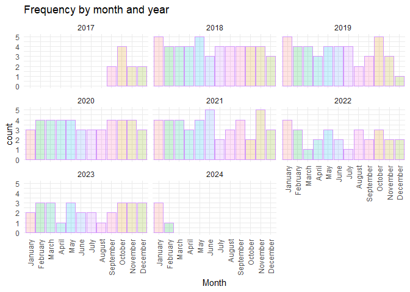

Ologies_Analysis
================
2024-05-06

# What’s in an Ology: A Breakdown of Ologies Episodes by Category

## Data wrangling

The dataframe read in here was generated using a python script which can
be found in the github. This script was used to parse ologies episodes
and extract meaningful information - duration of the episode, type of
ology, and date.

Data was then manually curated to add in broad classifications and
subcategories. These were based on Wikipedia designations of branches of
science: Formal, Natural, and Social sciences; with Applied or
Foundational designations. This was further broken down into additional
branches. Since many episodes are interdisciplinary, we gave primary and
secondary designations.

``` r
df <- read.csv("Ologies_Data.csv")
View(df)

df <- df[-c(12:14)] #trimming out extraneous columns

ologies <- df[!is.na(df$ology),] #selecting just the episodes with ologies
ologies <- ologies[!is.na(ologies$branch),] #excluding any NAs for branch - this also excludes smologies
View(ologies)

#we want to exclude encores so they aren't counted twice

ologies <- subset(ologies, encore == 0)

#same with part 2 episodes
ologies <- subset(ologies, part_2 == 0)

#final dataframe

dim(ologies)
```

    ## [1] 246  11

``` r
write.csv(ologies, file = "trimmed_ologies.csv")

ologies <- read.csv(file = "trimmed_ologies.csv")
```

Final analysis includes 246 unique episodes of Ologies by Alie Ward.

## What is the most common primary topic of Ologies?

``` r
#good but we can do better. let's reorder the dataframe so we can order by occurence


primary2 <- ggplot(data = ologies, aes(primary, fill = primary)) +
  geom_bar(stat = "count", col = "#d397fa", alpha = 0.2)  +
  theme_minimal() +
  theme(axis.text.x = element_text(angle = 90, hjust = 1, vjust = 0.5)) +
  ggtitle("Ologies episode by primary topic")
  
  
primary2
```

<!-- -->

\## By broad category

``` r
branch <- ggplot(data = ologies, aes(branch, fill = branch)) +
  geom_bar(stat = "count", col = "#d397fa", alpha = 0.2)  +
  theme_minimal() +
  theme(axis.text.x = element_text(angle = 90, hjust = 1, vjust = 0.5)) +
  ggtitle("Ologies episode by branch of science")
  
  
branch
```

<!-- -->

Transform frequency into a count variable using dplyr

``` r
ologies_count <- ologies %>%
  group_by(primary) %>%
  count(primary)
```

Re-order

``` r
ologies_count <- as.data.frame(ologies_count)
colnames(ologies_count) <- c("Primary", "Count")

ologies_order <- ologies_count[order(ologies_count$Count),]
ologies_order$Primary <- factor(ologies_order$Primary, levels = ologies_order$Primary)

ggplot(ologies_order, aes(x = Primary, y = Count, fill = Primary)) + 
  geom_bar(stat = "identity", col = "#d397fa", alpha = 0.2)  +
  theme_minimal() +
  theme(axis.text.x = element_text(hjust = 1, vjust = 0.5)) +
  ggtitle("Ologies episode by primary scientific category")+
  coord_flip()
```

<!-- -->

## Episode duration distribution

``` r
head(ologies)
```

    ##    X                                                                  title
    ## 1  1 Theoretical & Creative Ecology (SCIENCE & ECOPOETRY) with Madhur Anand
    ## 2  3             Evolutionary Anthropology (METABOLISM) with Herman Pontzer
    ## 3  6                              Carcinology (CRABS) Part 1 with Adam Wall
    ## 4  7             Ethnoecology (ETHNOBOTANY/NATIVE PLANTS) with Leigh Joseph
    ## 5 11                                  Lemurology (LEMURS) with Lydia Greene
    ## 6 12           Quasithanatology (NEAR-DEATH EXPERIENCES) with Bruce Greyson
    ##   release_date duration_ms duration_min            ology smologies encore
    ## 1     2/7/2024     3423791        57.06          Ecology         0      0
    ## 2    1/31/2024     5058324        84.31     Anthropology         0      0
    ## 3    1/16/2024     4087431        68.12      Carcinology         0      0
    ## 4     1/9/2024     4767425        79.46     Ethnoecology         0      0
    ## 5   12/20/2023     4563173        76.05       Lemurology         0      0
    ## 6   12/13/2023     5287340        88.12 Quasithanatology         0      0
    ##   part_2 branch      primary secondary
    ## 1      0    FNS          Art   Biology
    ## 2      0    FSS Anthropology   Biology
    ## 3      0    FNS      Biology      <NA>
    ## 4      0    FSS Anthropology   Biology
    ## 5      0    FNS      Biology      <NA>
    ## 6      0    FSS   Psychology   Biology

``` r
ologies_ms_order <- ologies[order(ologies$duration_ms),]
ologies_ms_order$duration_ms <- factor(ologies_ms_order$duration_ms, levels = ologies_ms_order$duration_ms)

ologies_ms_order <- subset(ologies_ms_order, X != 158)
ologies_ms_order <- subset(ologies_ms_order, X != 323)


durationplot <- ggplot(data = ologies_ms_order, aes(x = reorder(primary, -duration_min), y = duration_min, fill = primary)) +
  geom_boxplot(col = "#d397fa", alpha = 0.2) +
  geom_point(col = "#d397fa", alpha = 0.6)+
  theme_minimal() +
  xlab("Primary category") +
  ylab("Episode duration (minutes)") +
  theme(axis.text.x = element_text(angle = 90, hjust = 1, vjust = 0.5)) +
  theme(legend.position = "none") +
  ggtitle("Duration of Ologies episodes")

durationplot
```

<!-- -->

### Mean duration with error

``` r
ggplot(ologies_ms_order, aes(x = reorder(primary, -duration_min), y = duration_min, fill = primary)) + 
  geom_bar(stat="summary", fun.y="mean", col = "#d397fa", alpha = 0.2) + 
geom_errorbar(stat="summary", colour = "#d397fa", width = 0.2,
                fun.ymin=function(x) {mean(x)-sd(x)/sqrt(length(x))}, 
                fun.ymax=function(x) {mean(x)+sd(x)/sqrt(length(x))}) +
  theme_minimal() +
  theme(axis.text.x = element_text(angle = 90, hjust = 1, vjust = 0.5)) +
  ggtitle("Mean duration of ologies episodes (with error)")
```

    ## Warning in geom_bar(stat = "summary", fun.y = "mean", col = "#d397fa", alpha =
    ## 0.2): Ignoring unknown parameters: `fun.y`

    ## Warning in geom_errorbar(stat = "summary", colour = "#d397fa", width = 0.2, :
    ## Ignoring unknown parameters: `fun.ymin` and `fun.ymax`

    ## No summary function supplied, defaulting to `mean_se()`
    ## No summary function supplied, defaulting to `mean_se()`

<!-- -->

## Ologies over time: distribution by year, month

``` r
#split the release date column so we can look by month, year

ologies[c('Month', 'Day', 'Year')] <- str_split_fixed(ologies$release_date, '/*/', 3)


year <- ggplot(data = ologies, aes(Year, fill = Year)) +
  geom_bar(stat = "count", col = "#d397fa", alpha = 0.2)  +
  theme_minimal() +
  theme(axis.text.x = element_text(angle = 90, hjust = 1, vjust = 0.5)) +
  ggtitle("How many episodes released per year?")
  
year
```

<!-- -->
\### Month

### Months with correct labels

``` r
#create month labels

monthNames2 <- c("January", "February", "March", "April", "May", "June", "July", "August", "September", "October", "November", "December")

month <- ggplot(data = ologies, aes(Month, fill = Month)) +
  geom_bar(stat = "count", col = "#d397fa", alpha = 0.2)  +
  theme_minimal() +
  theme(axis.text.x = element_text(angle = 90, hjust = 1, vjust = 0.5)) +
  theme(legend.position = "none")+
  scale_x_discrete(limits = c('1', '2', '3','4','5','6','7','8','9','10','11','12'), labels = monthNames2)+
  ggtitle("Frequency by month (cumulative)")
  
month
```

<!-- -->

### Split by year

``` r
#split by year

monthNames2 <- c("January", "February", "March", "April", "May", "June", "July", "August", "September", "October", "November", "December")

monthyear <- ggplot(data = ologies, aes(Month, fill = Month)) +
  geom_bar(stat = "count", col = "#d397fa", alpha = 0.2)  +
  theme_minimal() +
  facet_wrap(~Year) +
  theme(axis.text.x = element_text(angle = 90, hjust = 1, vjust = 0.5)) +
  theme(legend.position = "none")+
  scale_x_discrete(limits = c('1', '2', '3','4','5','6','7','8','9','10','11','12'), labels = monthNames2)+
  ggtitle("Frequency by month and year")
  
monthyear
```

<!-- -->
